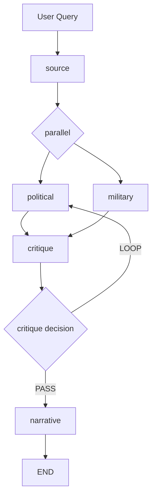

# AI Coding Agent Instructions for the Itihas Repository

## Purpose

This file is the operational guideline for any AI coding agent working on Itihas.
It defines repository rules, architecture expectations, coding conventions, and the exact workflow for adding or changing functionality.

## Core Principles

- Keep the repo modular: backend, frontend, processing, retrieval, storage, and agents are separate.
- Do not move logic across layers. The backend should not contain retrieval or agent logic; the agent graph should not embed frontend code.
- All runtime configuration belongs in `config/settings.py` or environment variables.
- Use `AgentState` in `src/agents/state.py` as the single shared contract between agent nodes.
- Do not invent new communication channels between agents.

## Project Structure

- `backend/`: FastAPI app and route definitions.
- `frontend/`: React SPA with Tailwind styling.
- `src/agents/`: LangGraph agent nodes and orchestrator graph.
- `src/retrieval/`: BM25 and dense retrieval plus fusion.
- `src/storage/`: Postgres access, ingestion, and file persistence.
- `src/processing/`: Document extraction, OCR, language detection, chunking, bias tagging, embedding.
- `src/utils/`: Shared utilities, logger, and LLM client.
- `tests/`: Pytest coverage for agents and core modules.

## Agentic Workflow

The workflow is defined in `src/agents/graph.py`.
All agents are standalone nodes in `src/agents/`.
The graph entry point is `run_query(query: str)`.

Graph flow:

- `source_node` retrieves relevant chunks, triages them with an LLM, and provides the evidence bundle.
- `political_node` analyzes the evidence for power, bias, omission, and framing.
- `military_node` analyzes the evidence for plausibility, logistics, and operational consistency.
- `critique_node` compares political and military outputs and decides whether to loop or proceed.
- `narrative_node` synthesizes the final report after critique passes.

> Note: the loop edge in this repository returns to `political_agent`. Because `source_agent` has already branched into both `political_agent` and `military_agent`, LangGraph re-enters the parallel analysis stage when the loop is taken.

## Agent Node Rules

- Each node file must export one function that accepts `AgentState` and returns a partial state update dict.
- Each node must return only the keys it updates.
- Nodes should not mutate the incoming state in place.
- Use `src/utils/llm_client.py` for all LLM calls.
- Each node must append a `debug_log` entry.
- If an unrecoverable error occurs, return `{"error": str, "debug_log": [str]}`.

## LLM Usage

- The only allowed LLM interface is `src/utils/llm_client.py`.
- Supported backends: `openai`, `hf`, `ollama`.
- Do not import OpenAI, HuggingFace, or Ollama SDKs anywhere except in `src/utils/llm_client.py`.
- Use `call(...)` for standard generation and follow `_openai_sdk_call` retry conventions.
- Use low temperature values for agent analysis prompts.

## Retrieval Rules

- Use `src/retrieval/fusion.py` as the retrieval entrypoint.
- Do not call `bm25_retriever` or `dense_retriever` directly from agents.
- Retrieval is hybrid:
  - BM25 keyword search from `src/retrieval/bm25_retriever.py`
  - Dense embedding search from `src/retrieval/dense_retriever.py`
  - Fusion via `reciprocal_rank_fusion`
- If reranking is enabled in settings, `fusion.py` invokes the reranker.

## Backend Rules

- `backend/main.py` configures FastAPI, CORS, and optional static frontend serving.
- `backend/routes/query.py` is the API boundary for `/api/v1/query`.
- The route calls `run_query()` and maps final `AgentState` into the response model.
- Citation resolution is done in the route using `documents` table lookup.
- Do not add direct database or LLM logic in backend routes.

## Frontend Rules

- Use `frontend/src/api/client.js` for all HTTP calls.
- Components should remain functional with hooks.
- `frontend/src/components/` contains UI panels: `QueryPanel.jsx`, `NarrativePanel.jsx`, `SourcePanel.jsx`, `GraphPanel.jsx`, `DebugPanel.jsx`.
- Do not bypass the API client.

## Testing

- Add unit tests under `tests/` corresponding to source modules.
- Agent tests belong in `tests/agents/`.
- Use mocks for external systems: DB, LLM, file IO.
- Aim for deterministic tests, not live API calls.
- Run tests with `pytest` before finalizing changes.

## Deployment and Configuration

- All secrets and deploy-time variables must come from environment variables.
- Primary config values live in `config/settings.py`.
- Do not hardcode credentials, models, or database URLs.
- `DB_URL`, `OPENAI_API_KEY`, `HF_API_TOKEN`, `OLLAMA_BASE_URL`, and `OLLAMA_MODEL` are configurable.

## Documentation Expectations

- Keep docs accurate and aligned with code.
- Do not describe features that are not implemented.
- Update this file whenever the architecture or agent graph changes.
